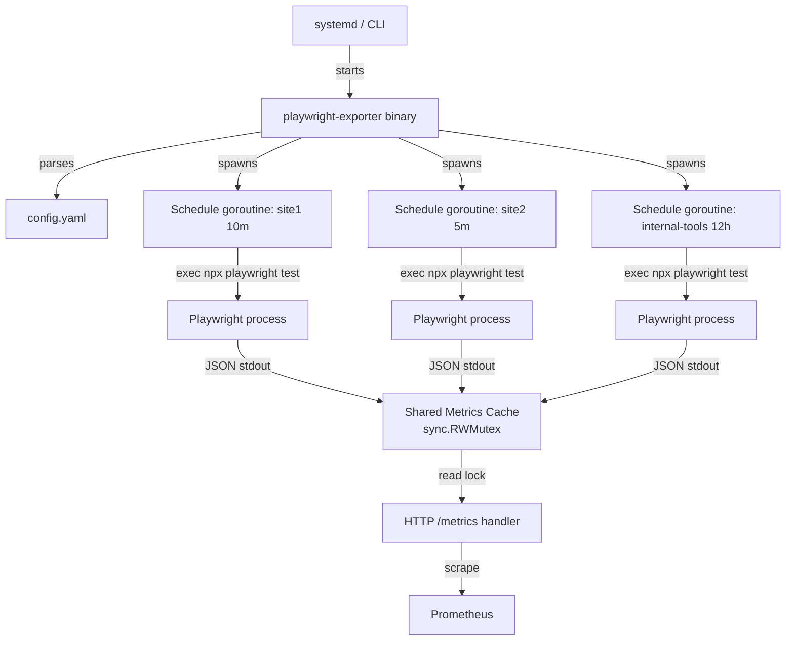

# playwright-exporter

A Prometheus exporter that runs Playwright test suites on independent schedules and exposes results as metrics for synthetic monitoring.

## Architecture



## Prerequisites

The exporter requires Node.js (v18+) and Playwright with Chromium. An install script handles
all dependencies across Ubuntu, RHEL-family, and Arch Linux:

    sudo ./scripts/install-deps.sh

See the script output for post-install steps.

## Quick Start

### 1. Install

Download a binary from the [releases page](https://github.com/maravexa/playwright-exporter/releases) or build from source:

```sh
go install github.com/maravexa/playwright-exporter@latest
```

### 2. Create config

```sh
cp config.example.yaml config.yaml
# Edit config.yaml to point at your Playwright test directories
```

### 3. Run

```sh
playwright-exporter -config config.yaml
```

Metrics are served at `http://localhost:9115/metrics`.

## Configuration Reference

```yaml
listen_address: ":9115"   # Required. Address to bind the HTTP metrics server.

schedules:
  - name: my_schedule         # Required. Unique name; alphanumeric + underscores only.
    interval: 10m             # Required. How often to run. Must be > 0.
    timeout: 8m               # Optional. Must be < interval. Default: 80% of interval.
    playwright_dir: /path/to/tests  # Required. Must exist and be a directory.
    command: "npx playwright test --reporter=json"  # Optional. Default shown.
    labels:                   # Optional. Attached to test-level metrics.
      site: example           # Keys must be valid Prometheus label names.
      tier: production        # Keys must not be: schedule, test, step (reserved).
```

### Validation rules

| Field | Rule |
|-------|------|
| `listen_address` | Non-empty |
| `schedules` | At least one entry |
| `name` | Unique, matches `[a-zA-Z_][a-zA-Z0-9_]*` |
| `interval` | Valid Go duration, > 0 |
| `timeout` | Valid Go duration, < `interval`; defaults to 80% of `interval` |
| `playwright_dir` | Must exist and be a directory at startup |
| `command` | Non-empty; defaults to `npx playwright test --reporter=json` |
| `labels` keys | Valid Prometheus label names; not `schedule`, `test`, or `step` |

## Metrics Reference

### Schedule-level

| Metric | Type | Labels | Description |
|--------|------|--------|-------------|
| `playwright_up` | Gauge | `schedule` | 1 if last run had no exporter-level error, 0 otherwise. Test failures do NOT set this to 0. |
| `playwright_last_run_timestamp_seconds` | Gauge | `schedule` | Unix timestamp of last successful run completion. |
| `playwright_run_duration_seconds` | Gauge | `schedule` | Wall-clock duration of last test suite execution. |
| `playwright_schedule_interval_seconds` | Gauge | `schedule` | Configured interval in seconds. Useful for staleness alerting. |
| `playwright_run_skip_total` | Counter | `schedule` | Total skipped runs because a previous run was still in progress. |

### Test-level

| Metric | Type | Labels | Description |
|--------|------|--------|-------------|
| `playwright_test_success` | Gauge | `schedule`, `test`, + custom | 1 if the test passed on its last run, 0 otherwise. |
| `playwright_test_duration_seconds` | Gauge | `schedule`, `test`, + custom | Duration of the test in seconds on its last run. |

### Exporter meta

| Metric | Type | Description |
|--------|------|-------------|
| `playwright_exporter_build_info` | Gauge | Always 1. Labels: `version`, `goversion`. |
| `go_*` | various | Standard Go runtime metrics. |
| `process_*` | various | Standard process metrics. |

## Alerting Examples

```yaml
groups:
  - name: playwright
    rules:
      # Alert when a schedule hasn't produced a result in 2× its interval.
      - alert: PlaywrightStaleness
        expr: time() - playwright_last_run_timestamp_seconds > 2 * playwright_schedule_interval_seconds
        for: 5m
        labels:
          severity: warning
        annotations:
          summary: "Playwright schedule {{ $labels.schedule }} results are stale"
          description: >
            Schedule {{ $labels.schedule }} last completed
            {{ $value | humanizeDuration }} ago but its interval is
            {{ with printf "playwright_schedule_interval_seconds{schedule=\"%s\"}" $labels.schedule | query }}{{ . | first | value | humanizeDuration }}{{ end }}.

      # Alert when a test is failing.
      - alert: PlaywrightTestFailing
        expr: playwright_test_success == 0
        for: 0m
        labels:
          severity: critical
        annotations:
          summary: "Playwright test {{ $labels.test }} is failing"
          description: "Schedule {{ $labels.schedule }} test {{ $labels.test }} failed on its last run."

      # Alert when the exporter itself has an error (e.g. Playwright crashed).
      - alert: PlaywrightExporterError
        expr: playwright_up == 0
        for: 5m
        labels:
          severity: warning
        annotations:
          summary: "Playwright exporter error for schedule {{ $labels.schedule }}"
```

## Systemd Installation

```sh
# Copy binary
sudo install -m 755 playwright-exporter /usr/local/bin/

# Create user
sudo useradd --system --no-create-home playwright-exporter

# Create config directory
sudo mkdir -p /etc/playwright-exporter
sudo cp config.yaml /etc/playwright-exporter/config.yaml
sudo chown -R playwright-exporter: /etc/playwright-exporter

# Create temp directory (used by Playwright)
sudo mkdir -p /tmp/playwright-exporter
sudo chown playwright-exporter: /tmp/playwright-exporter

# Install and start the service
sudo cp playwright-exporter.service /etc/systemd/system/
sudo systemctl daemon-reload
sudo systemctl enable --now playwright-exporter

# Check status
sudo systemctl status playwright-exporter
sudo journalctl -u playwright-exporter -f
```

## Notes

- **Test discovery at startup**: The `playwright_dir` for each schedule is verified to exist at startup. The exporter will refuse to start if any configured directory is missing.

- **Persistent stale metrics**: If a test that existed in a previous run disappears from the suite (e.g. the test was deleted), the old metric will persist with its last-known value until the exporter restarts. This is intentional for v1 and is visible via the `playwright_last_run_timestamp_seconds` staleness pattern.

- **Authentication**: Each schedule's Playwright tests handle their own authentication independently. There is no session sharing between schedules — this is intentional for failure isolation.

- **Shared test utilities**: Each schedule directory is independent. If you need shared test utilities across directories, put them in a common library and import them in your individual Playwright configs.

- **Adding a new suite**: The exporter only runs schedules defined in the config file. Adding a new test directory requires adding a corresponding `schedules` block to the YAML and restarting the service.

- **Non-zero exit is not a failure**: Playwright exits non-zero when tests fail, but the exporter still parses the JSON output and records per-test results. `playwright_up` is set to 0 only when the exporter itself cannot execute or parse results (e.g. process crash, timeout, malformed output).
